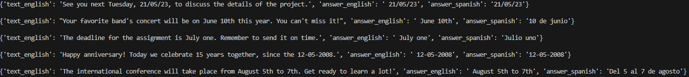
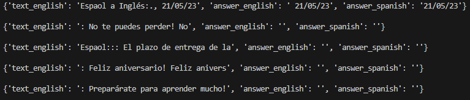
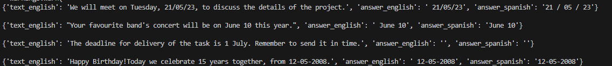
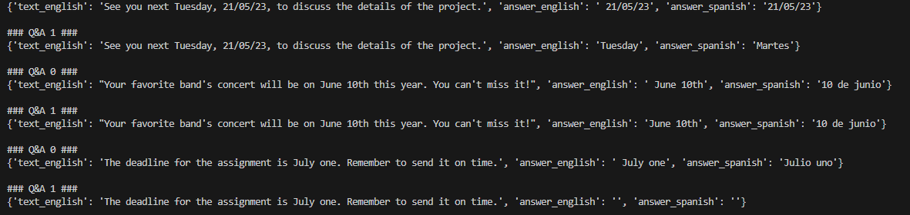

# DateExtractor
## By
- Juan Miguel Ramos Pugnaire
- Juan Ortega Ortega
- Pablo Cardenal Real de Asúa

## Goals

The aim of this projet is to create a program able to extract and parse the dates in a given document. This program will later be used to extract information from legal documents regarding the appraisal of assets. They are written manually and, as such, the date can come in a wide variety of ways. For example, the date 17/05/2023 could be written like "diecisiete de mayo de dos mil veintitrés", "17 de Mayo de 2023", "Diecisiete de Mayo de 2023", etc. Even though all represent the same date finding and parsing it is a good challenge. 

In this project we will use the transformers available in the HuggingFace library to extract the date from a variety of contexts. We will test the accuracy of the model on texts of different lengths to determine 

## Data Set

As previously mentioned, the data set will be comprised of legal documents related to the appraisal of assets called Simple Notes. They contain information about the asset's owner and the legal situation of it. A very important piece of information is the expiration date as it indicates when this situation may change. As has been previously mentioned, there are many ways the date may appear so we will need to consider flexible models that can understand context and exctract meaningful information of it. 

To add to the carrying list of problems, there is no general structure to these documents and they vary widely with the location of the asset. This is because they usually depend on the Register Name and they are roughly divided by city. On top of that, some of Simple Notes don't even have embedded text and we will have to discard them. An alternative could be using an OCR but that is well beyond the scope of this project. Thus, we will need to filter these documents so that we can treat only those whose text can easily be extracted and worked with. 

## Models used

The simplest method of extracting dates we would use are Regular Expresions, RegEx. They are the cornerstone of many text processing problems and we would like to make the most of them. However, due to the high amount of ways the date can appear the RegEx may become too complex to even be useful. On top of that, given the high variance of the ways a date can be written and the need to understand the context surrounding it we have decided to skip this process. This would be an example if we knew the pattern and the formate the date has.  

```
    import re
    # open a text file
    f = open("apple2.txt", 'r')
    # extract the file's content
    content = f.read()
    # a regular expression pattern to match dates
    pattern = "\d{2}[/-]\d{2}[/-]\d{4}"
    # find all the strings that match the pattern
    dates = re.findall(pattern, content)
    for date in dates:
        print(date)
    f.close()
``` 

Once the RegEx have been taken to their limit we have decided to explore the available resources on Hugging Face. They provide a plethora of transformers that could help us parse the text. On top of that, given the power of those models we may be able to get even more information out of the documents. However, we may be at a disadvantage. These transformers have been made in English so we will have to use a convoluted set of transformers to even start using them. 

This has, however, led to very good results regarding the extraction of the dates. As a debugging or error correction feature we have decided to output both the date extracted in English and the one we want in Spanish. 

### Translator Transformer
The translator has been chosen from various models, the most popular model is the t5-large one [https://huggingface.co/t5-large] however this model did not give the best results, as it can be implemented if the choose_model is selected to be equal to one, the best results are given when traduced from englsh to anothr language but viceversa it is not that accurate. One of the most liked models is the facebook model, this one performs good however when translating from spanish to english it still has some flaws. The best model in the end is the Helsinki one since it has been trained only for spanish and english. 
- Flaws: there are some phrases that cannot be extracte as a date, for example the phrase "this year" cannot be interpreted or the phrase next month or next week. Moreover, extracting dates that
        have the year or the month too apart from themselves is also an impossible task, this tends to happen when in comes to years as day amd month are closely related, the year when written in leters at a distance of two words cannot be exracted, in order to do so, a second queston must be asked as to what is the year of the event, in this case it must be checked if the year is indeed in the original question and if not it must be added.
- Strengths: There are libraries such as datefinder that are execute to extract dates but cannot perform as well as this Extraction Service, moreover python libraries are not suitable for multiple languages such as spanish making the translator an essential part of te project.  

These are some of the results for the short texts:  
Helsinki Model:  
  

TD5-large(not built for translatingo from spanish to english):  
  

Facebook model   
  

The Helsinki model is clearly better than the [https://huggingface.co/facebook/nllb-200-distilled-600M] model

### Question Answeing Transformer
To avoid developing a new and fresh set of data where dates in every format and every possible date of every combination are labeled as an entity to execute an entity recognition network we chose to use hugginface trnasformers again, this time based on the results of the huggin face community  [https://huggingface.co/deepset/roberta-base-squad2] the roberta-base-squad2 is the most downloaded and most liked model of all dispite having relatively low performance:  

```
    "exact": 79.87029394424324,
    "f1": 82.91251169582613,
```   

The second model we used as transformer in hugging face is the second most downloaded one [https://huggingface.co/docs/transformers/main/en/model_doc/bert#transformers.BertForQuestionAnswering].This model is based on Bert and it is really powerfull. Their performance is way better:  

```
    f1 = 93.15
    exact_match = 86.91
```  

Using the best translator which one is the best model? As we can observe in the following picture, the supponsingly best model cannot answer some of the questions and others are not the correct answer, therefore we concluded that it is best to use the Robert-base-squad2


